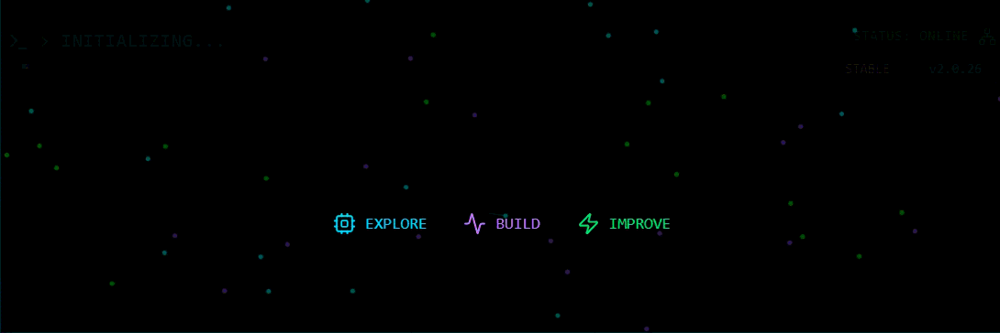

  

---

# 👩‍💻 About Me

> *Computer Programming Student @ Ankara University* 🎓
> *Aspiring Software Engineer* 🚀

Hi! I'm **Ebrar**👋

I am a Computer Programming student at Ankara University with a passion for technology, creativity, and continuous self-improvement.

I enjoy building projects that allow me to learn new concepts, explore different areas of software development, and gain experience through practice. Every challenge is an opportunity to grow, and I constantly seek ways to expand both my technical knowledge and problem-solving abilities.

My approach is simple: keep learning, keep building, and never stop improving.

🎯 Currently working toward becoming a Software Engineer and lifelong learner.

# 💻 Tech Stack

  

 

 

 

 

 

---

  
<b>Think we'd be a good fit? Let's get in touch.</b>

  <code>> mailto: 3brarofficial@gmail.com</code>

